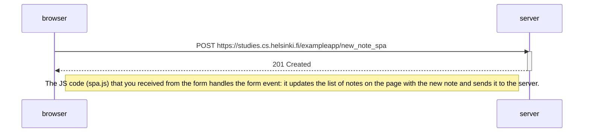

```mermaid

sequenceDiagram
    participant browser
    participant server

    browser->>server: POST https://studies.cs.helsinki.fi/exampleapp/new_note_spa
    activate server
    server-->>browser: 201 Created
    deactivate server

    Note right of browser: The JS code (spa.js) that you received from the form handles the form event: it updates the list of notes on the page with the new note and sends it to the server. 

```
